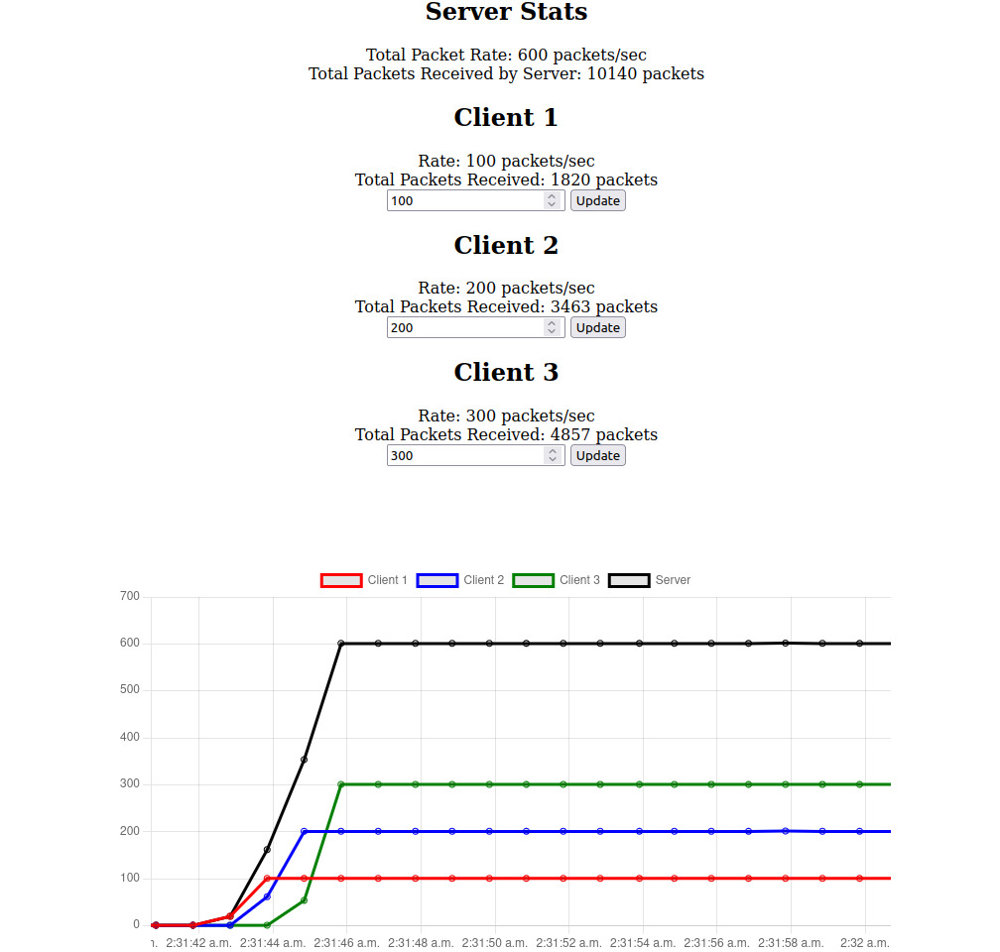

### TCP Packet rate controlled traffic flow
#### Multiple Clients <--> Single Server

### Config  
| Parameter | Located At | Definition |
|----------|----------|----------|
| totalClients| main.go [#18] | Total Mock Clients |
| ListenPort| main.go [#19]| Port at which Server Accepts Client Req|
| ServeDashboardPort | main.go [#20] | Port at which Dashboard html/js files are served |

### Usage
- `go mod tidy`
- `go run main.go`
- On browser go to `localhost:ServeDashboardPort` to view and update the packet rates
- Critical logs are printed on terminal

### Project Structure 
```
.
├── client
│   └── client.go   #contains client logic
├── go.mod
├── go.sum
├── main.go         #contains server logic
├── README.md
└── static
    ├── chart.js    #dashboard config and logic
    └── index.html  #html
```

### Dashboard Still Image

